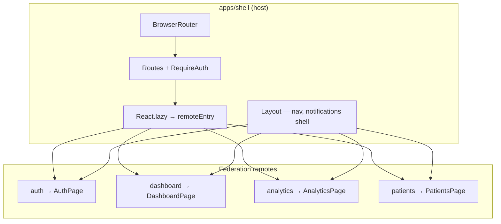
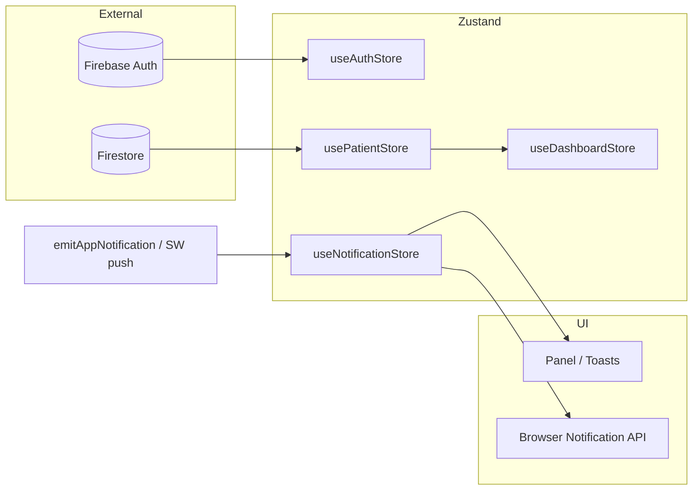

# MedNexus

A B2B healthcare SaaS–style UI: authentication, dashboard, analytics, and patient management, implemented as a **Module Federation** host with independent remotes, **Nx** monorepo layout, **React + TypeScript**, **Zustand**, **Firebase** (Auth + Firestore), and **Tailwind**.

## Try it

| | |
|--|--|
| **Live** | https://mednexus-shell.vercel.app/ |
| **Demo login** | **Email:** `divyanshajariya3@gmail.com` · **Password:** `123456` |

---

## Assignment scope (brief)

| Requirement | What MedNexus does |
|-------------|-------------------|
| React + TypeScript | All apps and libraries |
| State management | **Zustand** (domain stores + `persist` for auth) |
| Auth (Firebase) | Login/signup flows; session + guarded routes |
| Pages | Login, Dashboard, Analytics, Patients (shell-routed) |
| Patients | Grid + list, toggle, filters/search/pagination; Firestore CRUD; detail/edit in **dialogs** on `/patients` |
| Notifications (SW) | `apps/shell/public/sw.js` — lifecycle, `push`, `notificationclick`; in-app feed + toasts + optional browser notifications; `emitAppNotification` + host/event bridge |
| Bonus | MFEs, shared UI libs, lazy-loaded federated routes |

---

## Features (checklist)

- **Authentication:** Firebase Auth (`signIn` / signup path); form validation and error UI; `useAuthStore` with partial **persist** (`mednexus-auth`).
- **Application shell:** Single **React Router** on the host; `RequireAuth` → `/login`; `React.lazy` + `import()` for each remote; **navigate** passed into remotes that need host routing (avoids duplicate router context in federated bundles).
- **Dashboard:** KPI-style summary and recent activity derived from patient data.
- **Analytics:** See [Analytics page](#analytics-page) below (patient-derived KPIs + Recharts).
- **Patients:** List/grid **view toggle**; search and filters; pagination; add/edit flows; **Firestore** as backing store.
- **Notifications:** Shell `NotificationCoordinator` + `browserNotifications`; service worker (`/sw.js`); in-app history + toasts (`useNotificationStore`, persisted); see [Notifications](#notifications) below.

### Notifications

**Where:** `apps/shell/src/app/components/NotificationCoordinator.tsx`, `browserNotifications.ts`, `apps/shell/public/sw.js`; domain emits via `emitAppNotification` (`libs/shared/utils`).

**Polling every 60 seconds (overdue visits)**

- Constant: `VISIT_CHECK_INTERVAL_MS = 60 * 1000`.
- Runs only when the user is **authenticated**.
- **First run immediately** on login, then **`setInterval` every 60s**, and again when the tab becomes **visible** (`visibilitychange` → `runCheck`).
- Each tick: **`fetchPatientsFromFirestore()`** (full list), then for each patient:
  1. **`isPatientVisitDue(patient)`** must be true — “due” means `getNextVisitDueAt(patient) ≤ now` (see `libs/patients/data-access` **`visitSchedule.ts`**): **discharged** → never due; **critical** → next slot from twice-daily **08:00 / 14:00** from last visit; all other active statuses → once daily **10:00** from last visit / admission.
  2. **`getNextVisitDueAt`** must exist (guards discharged).
  3. **Dedup:** `localStorage` key **`mednexus-notified-visits`** stores last notify time per `patient.id`. If the same patient was already notified **within the last 60 seconds**, skip (avoids duplicate OS toasts while still overdue).
- If all checks pass → **`showLocalNotification`** (“Doctor visit due”, name, tag `patient-due-<id>`, links to `/patients`).

**Event-driven (not on the 60s timer)**

- **`PatientsPage`** after save: **create** → “New patient added”; **edit** and **not overdue** → “Doctor check scheduled” + next time; **edit** and **already overdue** → immediate “Doctor visit due” (`emitAppNotification`).

**Delivery path**

- **`showLocalNotification`** always appends to **`useNotificationStore`** (in-app list + toasts; notification list **persisted** as `mednexus-notifications`). If permission is granted, shows **browser** `Notification` (and service worker `showNotification` when applicable). **`push`** in `sw.js` handles real push payloads when the app is in the background.

### Analytics page

Route: **`/analytics`** (`libs/analytics/feature` — **Recharts**). Data comes from **`usePatientStore`** (loads a full cohort via `queryPatients` when the list is empty).

**KPI cards (non-discharged patients)**

| Card | What it shows |
|------|----------------|
| Active patients | Count of patients not `discharged` |
| Critical care ratio | % of active patients in **critical** or **observation** status |
| Attention required | Count with **overdue** doctor visit (`isPatientVisitDue`) |
| Recent admissions | Admitted in the **last 7 days** (`admittedAt`) |

**Charts**

| Chart | Type | What it shows |
|-------|------|----------------|
| Department occupancy | Horizontal bar | Active patients per **department** |
| Patient status distribution | Donut / pie | Breakdown: stable, critical, observation, improving (+ other statuses) |
| Age demographics | Vertical bar | Active patients by age bracket (0–18, 19–35, 36–50, 51–65, 65+) from **date of birth** |

---

## Architecture

### Repo hierarchy

```
mednexus/
├── apps/
│   ├── shell/                 # Host: routing, auth guard, layout, SW, federation consumer
│   └── {auth,dashboard,analytics,patients}/   # Remotes: each exposes one federated entry
├── libs/
│   ├── shared/                # types, ui, firebase, data-access (e.g. notifications), utils
│   └── {auth,dashboard,analytics,patients}/
│       ├── feature/           # Screens, forms, domain UI
│       └── data-access/       # Zustand + Firestore/API (where applicable)
├── tailwind.config.js         # Shared preset → consumed per app
└── implementation_plan.md     # Product roadmap (human-oriented)
```

### Runtime: host vs remotes



- **Host owns navigation truth:** Remotes **do not** rely on their own `BrowserRouter` when embedded in the shell; the shell passes **`navigate`** (and callbacks like `onLoginSuccess`) so hooks run under the host’s router.
- **Remotes stay thin at `app.tsx`:** Prefer wiring **from `libs/<domain>/feature`**, not large duplicated UI inside `apps/<remote>/`.

### Layering (Nx libs)

| Layer | Responsibility |
|-------|----------------|
| `apps/*` | Bootstrap, Vite federation config, minimal glue |
| `libs/*/feature` | Page-level UI, composition, local UI state |
| `libs/*/data-access` | Zustand stores, Firestore/API calls for that domain |
| `libs/shared/*` | Types, design-system-style UI, Firebase client, cross-cutting stores/utils |

Imports use **`tsconfig` path aliases** (e.g. `@mednexus/patients/data-access`) — see `docs/ai-agent-context/04-code-conventions.md`.

---

## Data flow & global state



| Store | Package | Notes |
|-------|---------|--------|
| `useAuthStore` | `@mednexus/auth/data-access` | User, `isAuthenticated`, errors; **persist** user flags only |
| `usePatientStore` | `@mednexus/patients/data-access` | List, selection, `queryPatients`, CRUD against Firestore |
| `useDashboardStore` | `@mednexus/dashboard/data-access` | Fetches via patient store, then **builds** dashboard aggregates (single patient source of truth) |
| `useNotificationStore` | `@mednexus/shared/data-access` | In-app notifications + toasts; **persist** keeps notification history (toasts rehydrate empty) |

- **Composition:** Dashboard **reads** `usePatientStore` after fetch — no second copy of patient rows.
- **Events:** `emitAppNotification` → `CustomEvent` / shell `__MEDNEXUS_NOTIFY__` → `showLocalNotification` → store + OS UI; overdue visit **poll** calls `showLocalNotification` directly when conditions match.

---

## How this maps to evaluation criteria

| Criterion | Approach in this repo |
|-----------|------------------------|
| **Code quality & structure** | Nx boundaries (`feature` / `data-access` / `shared`); TypeScript paths; Firebase isolated in `shared/firebase`; conventions in `docs/ai-agent-context`. |
| **UI/UX & responsiveness** | Shared Tailwind preset; reusable components under `libs/shared/ui`; patients grid/list and layout patterns for different densities. |
| **State management** | Zustand per domain; persisted auth; explicit composition (dashboard ← patients); notifications as a separate concern. |
| **Feature completeness** | Auth, four main areas, patient grid/list + CRUD, SW + at least one end-to-end notification path (in-app and/or push). |
| **Performance & practices** | Lazy federated chunks; avoid duplicate routers; debounced patient search where implemented. |
| **Scalability** | Add remote → `exposes` in Vite → shell route + Tailwind `content` paths; shared types in `libs/shared/types`. |

---

## Getting started

### Prerequisites

- Node.js (v18+)
- [pnpm](https://pnpm.io/)

### Install

From the repo root:

```sh
pnpm install
```

### Run (local dev)

Module Federation needs the remotes **built** (and previewed) while the shell is served. The repo script does that for you:

```sh
pnpm run dev
```

What it runs (see `package.json`): one-off `build:remotes`, then **concurrently** — `watch:remotes` (rebuild remotes on change), `preview:remotes` (static preview for auth, dashboard, analytics, patients on ports **3001–3004**), and `nx serve shell` (**3000**).

Open the app at **[http://localhost:3000](http://localhost:3000)**.

| Process | Port |
|---------|------|
| Shell (main UI) | 3000 |
| Auth remote | 3001 |
| Dashboard remote | 3002 |
| Analytics remote | 3003 |
| Patients remote | 3004 |

Optional: `pnpm start` runs `nx run-many -t serve --all` (different workflow; federation details in [`docs/ai-agent-context/02-mfe-and-nx-structure.md`](docs/ai-agent-context/02-mfe-and-nx-structure.md)).

---

## AI / contributor conventions

Agent-oriented rules (Tailwind content paths, federation pitfalls, must-not-do) live under **`docs/ai-agent-context/`** — start with [`docs/ai-agent-context/README.md`](docs/ai-agent-context/README.md).
