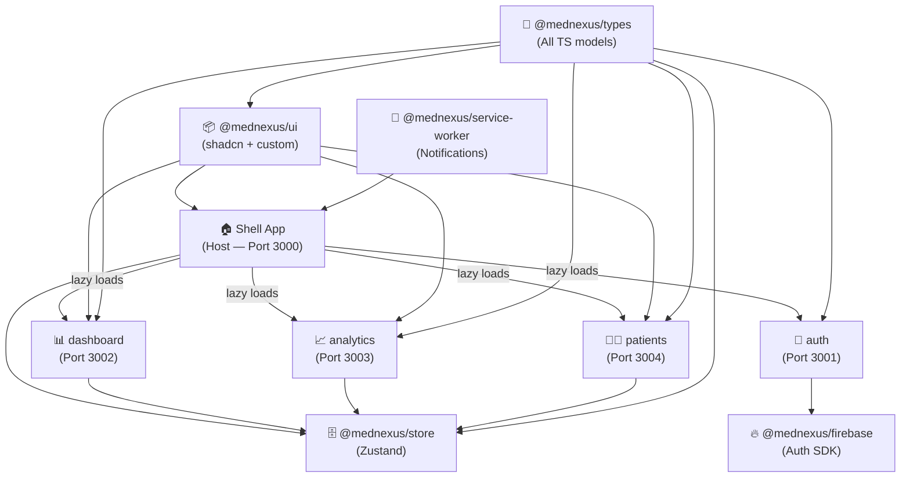

# MedNexus — B2B Healthcare SaaS UI

> **"Nexus"** = the central connection point. MedNexus is where clinicians, analysts, and administrators converge.

A B2B Healthcare SaaS platform demonstrating micro-frontend architecture, modern React patterns, and real-world healthcare data workflows.

---

## 🎨 Brand Identity

| Attribute | Value |
|-----------|-------|
| **Name** | **MedNexus** |
| **Color Palette** | Deep Indigo `#312e81` + Teal `#0d9488` + Charcoal `#1e293b` |
| **Font** | Inter (headings) + DM Sans (body) |
| **Theme** | Dark-first, glassmorphism accents |

---

## 🏗️ Architectural Strategy — Micro-Frontends

### Approach: **Vite Module Federation + Nx Monorepo**

We use **`@originjs/vite-plugin-federation`** to implement Runtime Module Federation. The monorepo is managed by **Nx** for orchestrated builds, caching, and dependency graph tracking.

> **Why Nx over Turborepo?**
> Nx has first-class support for micro-frontend architecture with a built-in **Module Federation generator** (`@nx/react:host` / `@nx/react:remote`) that scaffolds all the vite federation config automatically. It also provides a powerful **project dependency graph** (`nx graph`), fine-grained affected task detection (`nx affected`), and per-project code generation — all critical for a multi-app MFE setup. Turborepo is simpler but generic; Nx is purpose-built for this kind of architecture.

```
mednexus/                          ← Nx monorepo root
├── apps/
│   ├── shell/                     ← Host app (React Router, layout, auth guard)
│   ├── auth/                      ← MFE: Login + Signup / Authentication
│   ├── dashboard/                 ← MFE: Home / Dashboard
│   ├── analytics/                 ← MFE: Analytics (charts)
│   └── patients/                  ← MFE: Patient Management
└── packages/
    ├── ui/                        ← Shared shadcn/ui + custom components
    ├── store/                     ← Shared Zustand stores
    ├── types/                     ← ALL TypeScript interfaces & models (single source of truth)
    ├── firebase/                  ← Firebase config & auth helpers
    └── service-worker/            ← SW registration & notification utils
```

### MFE Composition Flow



---

## 📦 Package Breakdown

Following Nx Enterprise Architecture Best Practices, we separate logic into **feature**, **ui**, **data-access**, and **utils** libraries. The `apps/` only contain routing and entry points.

### 🏠 Apps (Host & Remotes)
These are thin containers that compose features from `libs/`.

- **`apps/shell`**: The host application. Controls global routing, lazy-loads remote MFEs, and protects routes.
- **`apps/auth`**: MFE (Port 3001). Exposes Auth Routes.
- **`apps/dashboard`**: MFE (Port 3002). Exposes Dashboard.
- **`apps/analytics`**: MFE (Port 3003). Exposes Analytics.
- **`apps/patients`**: MFE (Port 3004). Exposes Patient Management.

---

### 📚 Libs — Shared Modules
Code used across multiple MFEs.

- **`libs/shared/ui`**: Base shadcn/ui components (`Button`, `Input`, `Card`) + custom wrappers.
- **`libs/shared/data-access`**: Global Zustand stores (e.g., `uiStore`, global `notificationStore`).
- **`libs/shared/types`**: TypeScript interfaces and types.
- **`libs/shared/utils`**: Reusable utility functions (e.g., `cn()`, API helpers).
- **`libs/shared/firebase`**: Firebase initialization and SDK config.

---

### 📚 Libs — Domain Modules
Business logic and features categorized by domain.

**Auth Domain (`libs/auth/*`)**
- **`libs/auth/feature`**: Contains `<LoginForm>`, `<SignupForm>`, and the `<AuthPage>` component.
- **`libs/auth/data-access`**: Zustand `authStore` + Firebase auth methods (`signIn`, `signUp`).

**Patient Domain (`libs/patients/*`)**
- **`libs/patients/feature`**: Patient Grid, Patient List, `<PatientsPage>`.
- **`libs/patients/data-access`**: Zustand `patientStore`, mock patient data.

**Dashboard & Analytics Domains**
- **`libs/dashboard/feature`**: `<DashboardPage>`, Stat Cards.
- **`libs/analytics/feature`**: `<AnalyticsPage>`, Recharts components.

---

## 🗂️ Detailed Folder Structure (Nx Enterprise Architecture)

```
mednexus/
├── nx.json                        ← Nx workspace config
├── package.json                   ← root package.json
├── apps/
│   ├── shell/                     ← Host app container
│   │   ├── src/
│   │   │   ├── app/app.tsx        ← Central routing & lazy MFE imports
│   │   │   └── main.tsx
│   │   └── vite.config.ts         
│   ├── auth/                      ← Auth Remote MFE
│   │   ├── src/
│   │   │   ├── app/app.tsx        ← Mounts AuthFeature component from libs
│   │   │   └── main.tsx
│   │   └── vite.config.ts         
│   ├── dashboard/
│   ├── analytics/
│   └── patients/
│
├── libs/                           ← ALL business logic & shared code lives here
│   ├── shared/                     ← Generic, domain-agnostic code
│   │   ├── ui/
│   │   │   └── src/
│   │   │       ├── lib/button.tsx     ← shadcn components
│   │   │       ├── lib/input.tsx
│   │   │       └── lib/card.tsx
│   │   ├── data-access/            ← Global Zustand stores
│   │   │   └── src/
│   │   │       ├── uiStore.ts
│   │   │       └── notificationStore.ts
│   │   ├── types/                  ← Global Types
│   │   │   └── src/
│   │   │       ├── auth.ts
│   │   │       ├── patient.ts
│   │   │       └── validations.ts
│   │   ├── firebase/               ← Firebase initialization
│   │   │   └── src/
│   │   │       └── index.ts
│   │   └── utils/
│   │       └── src/
│   │           └── index.ts
│   │
│   ├── auth/                       ← Authentication Domain
│   │   ├── feature/
│   │   │   └── src/
│   │   │       ├── lib/AuthPage.tsx     ← Extracted from Apps!
│   │   │       ├── lib/LoginForm.tsx
│   │   │       └── lib/SignupForm.tsx
│   │   └── data-access/
│   │       └── src/
│   │           └── lib/authStore.ts     ← Zustand store specific to Auth
│   │
│   ├── patients/                   ← Patients Domain
│   │   ├── feature/
│   │   │   └── src/
│   │   │       ├── lib/PatientsPage.tsx
│   │   │       ├── lib/PatientGrid.tsx
│   │   │       └── lib/PatientList.tsx
│   │   └── data-access/
│   │
│   ├── dashboard/                  ← Dashboard Domain
│   │   └── feature/
│   │
│   └── analytics/                  ← Analytics Domain
│       └── feature/
```

---

## 🔧 Tech Stack Summary

| Category | Technology |
|----------|-----------|
| Framework | React 18 + TypeScript |
| Build Tool | Vite 5 |
| Monorepo | **Nx** (with Vite + Module Federation support) |
| Micro-frontends | `@originjs/vite-plugin-federation` |
| Styling | **Tailwind CSS v3** + **shadcn/ui** |
| Components | **shadcn/ui** (base) + custom wrappers in `@mednexus/ui` |
| State | Zustand v4 |
| Type Models | `@mednexus/types` — single source of truth |
| Auth | Firebase Authentication (Login + **Signup**) |
| Routing | React Router v6 |
| Charts | Recharts |
| Forms | React Hook Form + Zod |
| Notifications | Service Worker + Web Notifications API |
| Package Manager | pnpm (workspaces) |

---

## 🖥️ Pages Overview

| Route | MFE Source | Description |
|-------|-----------|-------------|
| `/` → redirects to `/login` or `/dashboard` | Shell | Auth guard |
| `/login` | auth | Firebase login form |
| `/signup` | auth | Firebase signup form |
| `/dashboard` | dashboard | KPIs, activity feed |
| `/analytics` | analytics | Charts & trends |
| `/patients` | patients | Grid/List patient view |

---

## ✅ Verification Plan

### Phase 1 — Dev Servers
Run all apps concurrently:
```bash
npx nx run-many --target=serve --all
```
Visit `http://localhost:3000` and verify:
- [ ] Login page loads (mfe-auth federated)
- [ ] Login with valid Firebase credentials → redirects to dashboard
- [ ] Invalid credentials show error message
- [ ] All nav links load correct MFE pages

### Phase 2 — Feature Verification (Manual)
| Feature | Verification Step |
|---------|-----------------|
| Auth | Login/logout cycle works; protected routes redirect |
| Dashboard | Stat cards render with data; activity feed populates |
| Analytics | Three charts render; date filter updates data |
| Grid View | Patient cards render in 3-column grid |
| List View | Patient data renders in table/list rows |
| Toggle | Clicking toggle switch animates and switches views |
| Search | Typing filters visible patient records |
| Patient Detail | Click patient → drawer/modal opens with details |
| Notification | 5 seconds after login, a browser notification fires |
| Responsiveness | Shrink to 375px width — all pages adapt correctly |

### Phase 3 — Service Worker
```bash
# In Chrome DevTools → Application → Service Workers
# Verify "mednexus-sw" is active and running
# Check "Push" section for notification registration
```

### Phase 4 — Build Verification
```bash
pnpm turbo build
# All 5 apps should build without TS errors
```
